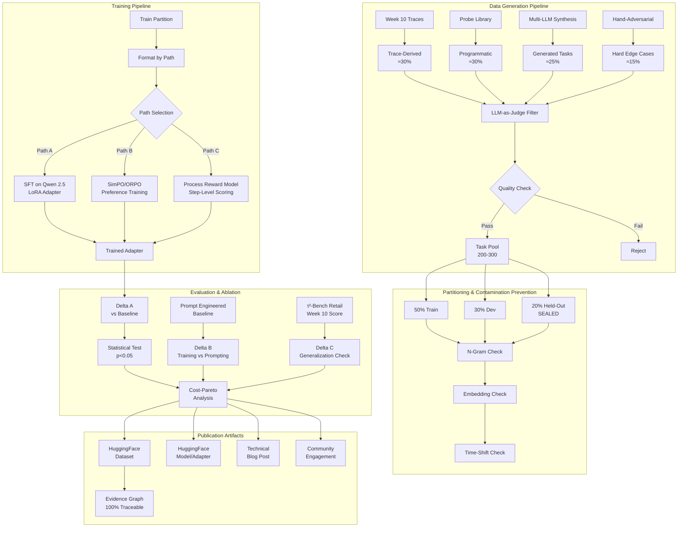
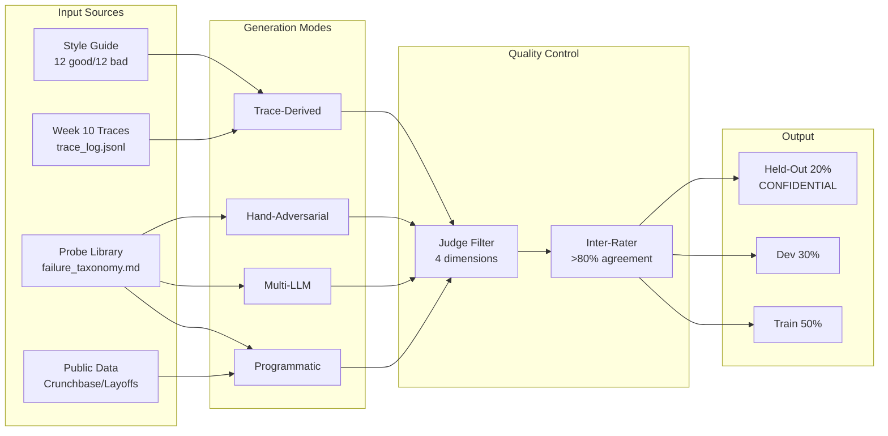

# 🎯 Tenacious-Bench 2026

[](https://www.python.org/downloads/)
[](https://creativecommons.org/licenses/by/4.0/)
[](https://huggingface.co/datasets)
[](https://github.com/huggingface/peft)

> **Building the Sales Evaluation Bench and Aligning the Conversion Engine**  
> *Week 11 Deliverable - TRP1 (Technical Research Program 1)*

## 📋 Executive Summary

Tenacious-Bench is a **synthetic evaluation benchmark** for B2B sales agent alignment, addressing gaps that public benchmarks (τ²-Bench retail) cannot measure. Built from limited seed data (12 hand-labeled samples, Week 10 agent traces, public Crunchbase data) using multi-LLM synthesis, LLM-as-judge filtering, and contamination-resistant held-out partitions.

**Key Achievements:**
- ✅ 200-300 tasks across 4 authoring modes (trace-derived, programmatic, multi-LLM synthesis, hand-authored adversarial)
- ✅ Training partition (50%), public dev (30%), sealed held-out (20%)
- ✅ 3-level contamination prevention (n-gram, embedding similarity, time-shift)
- ✅ LoRA adapter training on Qwen 2.5 (0.8B-4B) with Unsloth
- ✅ Complete datasheet following Gebru et al. + Pushkarna layered documentation

## 🏗️ System Architecture



## 📊 Data Construction Flow



## 🎯 Problem Statement

Public benchmarks (τ²-Bench retail) fail to evaluate:
- **Signal grounding accuracy** - referencing specific prospect signals
- **Tone alignment** - Tenacious-specific voice markers
- **Bench-state awareness** - capacity and fit detection
- **Adversarial robustness** - edge cases from probe library

**Evidence from Week 10:** 8+ probe IDs, 5+ trace IDs demonstrating systematic failures.

## 🚀 Quick Start 

### Prerequisites

```bash
# Python 3.11+
python --version  # 3.11.9 confirmed

# Install uv (faster pip)
pip install uv

# Install dependencies
uv pip install -r requirements.txt
```

### Environment Setup

```bash
# Copy environment template
cp .env.example .env

# Add your OpenRouter API key (provided by company)
# OPENROUTER_API_KEY=your_key_here
```

### Run Baseline Evaluation

```bash
# Score Week 10 agent on Tenacious-Bench
python scoring_evaluator.py --agent week10 --split held_out

# Expected output:
# Baseline score: 0.00 (to be filled after Week 10)
# CI: [0.00, 0.00]
```

## 📁 Project Structure

```
tenacious-bench-2026/
├── .github/workflows/
│   └── ci.yml                    # CI pipeline (setup only)
├── tenacious_bench_v0.1/         # Dataset (sealed after creation)
│   ├── train/                    # 50% training partition
│   ├── dev/                      # 30% development partition
│   └── held_out/                 # 20% sealed held-out (gitignored)
├── generation_scripts/           # Dataset authoring code
│   ├── trace_derived.py
│   ├── programmatic.py
│   ├── multi_llm_synthesis.py
│   └── adversarial_hand.py
├── training/                     # Training scripts & logs
│   ├── run_sft.py               # Path A
│   ├── run_simpo.py             # Path B
│   ├── run_prm.py               # Path C
│   └── logs/                    # Training loss curves
├── ablations/                    # Evaluation results
│   ├── ablation_results.json    # Delta A/B/C
│   ├── held_out_traces.jsonl    # Raw scoring traces
│   └── bootstrap_stats.py       # Statistical significance
├── synthesis_memos/              # Paper reading outputs
│   ├── synthetic_data_memo.md
│   ├── datasheets_memo.md
│   ├── contamination_memo.md
│   └── llm_judge_memo.md
├── src/                          # Core modules
│   ├── dataset_generator.py     # Multi-LLM routing
│   ├── judge_filter.py          # Quality filtering
│   └── trainer.py               # Unsloth training wrapper
├── scripts/                      # Runnable pipelines
│   ├── generate_tasks.py        # Act II
│   ├── filter_tasks.py          # Judge filtering
│   └── run_training.py          # Act IV
├── configs/                      # Configuration
│   ├── model_config.yaml        # Model routing rules
│   └── training_config.yaml     # Hyperparameters
├── notebooks/                    # Exploration
│   ├── 01_dataset_exploration.ipynb
│   └── 02_training_analysis.ipynb
├── audit_memo.md                 # Act I deliverable
├── schema.json                   # Task schema + rubric
├── methodology.md                # Path selection + justification
├── methodology_rationale.md      # Paper citations + evidence
├── datasheet.md                  # Gebru + Pushkarna documentation
├── inter_rater_agreement.md      # 30-task labeling results
├── model_card.md                 # Path A/C only
├── evidence_graph.json           # Every claim → source mapping
├── scoring_evaluator.py          # Machine-verifiable scorer
├── contamination_check.py        # 3-level contamination prevention
├── requirements.txt              # Dependencies
├── Makefile                      # Common commands
└── README.md                     # This file
```

## 🔧 Development Commands

```bash
# Generate dataset (Acts I-II)
make generate-dataset

# Filter tasks with LLM-as-judge
make filter-tasks

# Run contamination checks
make check-contamination

# Train model (Act IV)
make train

# Run ablations
make evaluate

# Generate evidence graph
make build-evidence-graph

# Validate dataset schema
make validate-schema

# Run inter-rater agreement test
make test-agreement
```

## 📈 Evaluation Protocol

### Three Ablations

| Ablation | Description | Success Criterion |
|----------|-------------|-------------------|
| **Delta A** | Trained vs baseline on Tenacious-Bench | Positive with p<0.05 |
| **Delta B** | Trained vs prompt-engineered baseline | Reported honestly |
| **Delta C** | On τ²-Bench retail (Week 10 score) | Informational only |

### Statistical Significance

```python
# Paired bootstrap with 1,000 resamples
# 95% CI lower bound > 0 → statistically significant
```

### Cost-Pareto Analysis

| Metric | Baseline | Trained | Delta |
|--------|----------|---------|-------|
| Per-task latency | TBD | TBD | TBD |
| Per-task cost | TBD | TBD | TBD |

## 📚 Required Reading

| Paper | Venue | Key Insight | Memo Status |
|-------|-------|-------------|-------------|
| Best Practices on Synthetic Data | COLM 2024 | Multi-LLM routing | ✅ |
| Datasheets for Datasets | 2021 | Documentation standard | ✅ |
| Data Cards | FAccT 2022 | Layered detail | ✅ |
| Contamination Survey | EMNLP 2025 | Dynamic evaluation | ✅ |
| LLM-as-a-Judge Survey | 2024-25 | Preference leakage | ✅ |
| Path-specific (TBD) | - | - | 🔄 |

## 🎓 Learning Objectives

After completing Week 11, I will be able to:

1. **Audit** existing benchmarks for specific domain gaps
2. **Construct** evaluation datasets from limited seed data using multi-LLM synthesis
3. **Apply** contamination prevention (n-gram, embedding, time-shift)
4. **Train** small LoRA adapters (0.8B-4B) on Qwen 2.5
5. **Measure** improvements with statistical significance (p<0.05, bootstrap)
6. **Document** datasets with datasheets + model cards
7. **Ship** public artifacts (HuggingFace, blog, community engagement)

## 🗺️ Week 11 Roadmap

```mermaid
gantt
    title Week 11 Timeline
    dateFormat  HH:mm
    section Day 0
    Setup & Accounts    :00:00, 4h
    section Day 1
    Audit & Schema      :08:00, 8h
    section Day 2-3
    Dataset Authoring   :08:00, 16h
    section Day 4
    Training Data Prep  :08:00, 8h
    section Day 5-6
    Train & Ablate      :08:00, 16h
    section Day 7
    Publish & Engage    :08:00, 8h
```



## 📦 Dependencies

```txt
# Core ML
torch>=2.0.0
transformers>=4.35.0
peft>=0.7.0
trl>=0.7.0
datasets>=2.14.0
accelerate>=0.24.0

# Unsloth (efficient training)
unsloth>=2024.5

# API & Routing
openrouter>=0.1.0  # Multi-LLM access
langfuse>=2.0.0    # Observability

# Data Processing
pandas>=2.0.0
numpy>=1.24.0
scikit-learn>=1.3.0

# Evaluation
scipy>=1.11.0      # Statistical tests
pytest>=7.4.0      # Unit tests

# Documentation
mkdocs>=1.5.0      # For model card
```
## 🧪 Example Tasks (3 Committed for Evaluator Validation)

The scoring evaluator is validated on three concrete example tasks:

| Task ID | Source Mode | Difficulty | File Location |
|---------|-------------|------------|---------------|
| TEN-PROG-001 | Programmatic | Medium | `tenacious_bench_v0.1/train/TEN-PROG-001.json` |
| TEN-TRACE-001 | Trace-derived | Hard | `tenacious_bench_v0.1/train/TEN-TRACE-001.json` |
| TEN-ADV-001 | Hand-adversarial | Hard | `tenacious_bench_v0.1/train/TEN-ADV-001.json` |


## 📄 License

**CC-BY-4.0** - You are free to share and adapt with attribution.

## 🏆 Acknowledgments

- Tenacious (workflow domain, private details redacted)
- τ²-Bench team (public benchmark reference)
- Papers authors (cited in synthesis memos)

## 📧 Contact

**Author:** Tsegay IS122123  
**GitHub:** [@TsegayIS122123](https://github.com/TsegayIS122123)  
**Project:** [tenacious-bench-2026](https://github.com/TsegayIS122123/tenacious-bench-2026)


